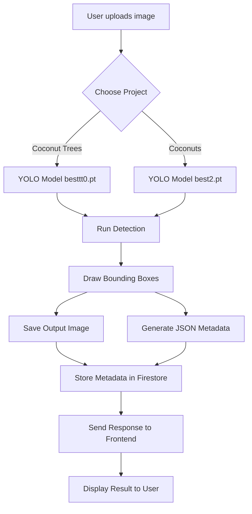

# 🌴 Coconut Detector (Flask + YOLO + Firebase Firestore)

This project is a **Flask-based web application** that detects **Coconut Trees** and **Coconuts** separately using two YOLO models. It also stores detection results in **Firebase Firestore** under separate collections for better organization.

---

## 🚀 Features

* Upload an image for **Coconut Tree** or **Coconut** detection.
* Run inference using YOLO models (`besttt0.pt` for trees, `best2.pt` for coconuts).
* Draw bounding boxes with confidence scores on detected objects.
* Save **output images** and **JSON predictions** locally.
* Store metadata in **Firebase Firestore** under:

  * `cocotrees` collection → tree-related detections
  * `coconuts` collection → coconut-related detections
* Simple **UI pages** for separate detection tasks.

---

## 📂 Project Structure

```
coconut-detector/
│── app.py                  # Flask backend with routes
│── firebase-key.json       # Firebase service account (DO NOT share publicly)
│── models/
│   ├── besttt0.pt          # YOLO model for Coconut Trees
│   ├── best2.pt            # YOLO model for Coconuts
│── ui/
│   ├── cocotrees.html      # Upload UI for trees
│   ├── coconuts.html       # Upload UI for coconuts
│   ├── outputs/            # (auto-generated) detected results
│── requirements.txt        # Python dependencies
│── README.md               # Documentation
```

---

## ⚙️ Setup Guide

### 1️⃣ Environment Setup

* Install **Python 3.8+**
* Create and activate a virtual environment:

```bash
python -m venv venv
source venv/bin/activate   # Linux/Mac
venv\Scripts\activate      # Windows
```

### 2️⃣ Install Dependencies

```bash
pip install -r requirements.txt
```

Content of `requirements.txt`:

```
flask
firebase-admin
ultralytics
opencv-python
uuid
```

### 3️⃣ Firebase Setup

1. Go to [Firebase Console](https://console.firebase.google.com/).
2. Create a project.
3. Enable **Cloud Firestore**.
4. Go to `Project Settings` → `Service Accounts` → **Generate new private key**.
5. Download the JSON file and rename it to:

   ```
   firebase-key.json
   ```

   Place this file inside the project root.

---

## ▶️ Running the Application

```bash
python app.py
```

Open in browser:

* **Coconut Trees Page** → `http://127.0.0.1:5000/cocotrees`
* **Coconuts Page** → `http://127.0.0.1:5000/coconuts`

---

## 🔄 Workflow (Flow Chart)



---

## 📊 Data Organization in Firestore

* **Collection: `cocotrees`**

  * Each document = one image detection result
  * Fields: `{ filename, predictions[], timestamp }`

* **Collection: `coconuts`**

  * Each document = one image detection result
  * Fields: `{ filename, predictions[], timestamp }`

---

## 🛡️ Security Notes

* Keep `firebase-key.json` **private**.
* Do **NOT** commit the key to GitHub or share it publicly.
* Use environment variables for deployment if possible.

---

